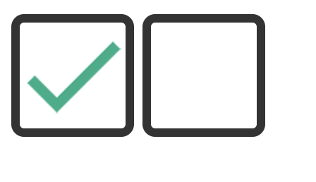

# custom_checkbox plug-in

<p>채크상자를 커스텀 디자인 구현한 편리한 플러그인입니다.</p>
## Example page https://csslick.github.io/custom_checkbox/
## Usage
```
<head>
  ...
  <script src="https://ajax.googleapis.com/ajax/libs/jquery/3.4.1/jquery.min.js"></script>
  <script src="./csslick_check/csslick_check.js"></script>
  <link rel="stylesheet" href="./csslick_check/csslick_check.css">
</head>

  <div class="check_list">
        <label for="">check</label>
        <input type="checkbox" name="check" checked>
        <label for="">check</label>
        <input type="checkbox" name="check">
  </div>
  
  <script>
    $(function () {
      // 옵션
      csslick_check({
        el: ".check_list",  // 변경불가(fixed value)
        color: "black",     // 색상
      });

    });
  </script>
 ```
